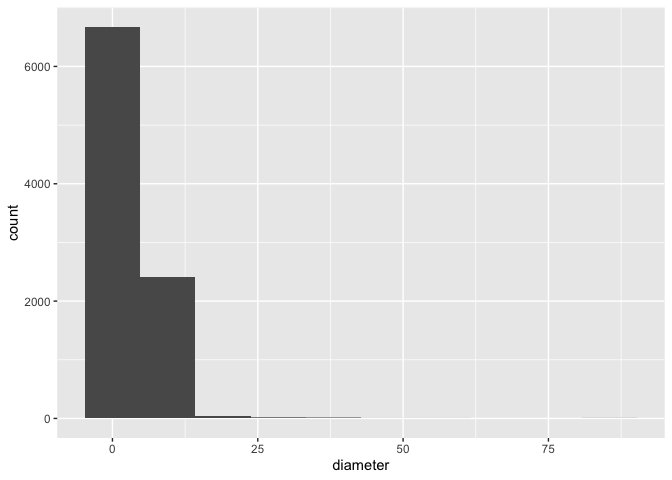

Mini Data-Analysis Deliverable 1
================

# Welcome to your (maybe) first-ever data analysis project\!

And hopefully the first of many. Let’s get started:

1.  Install the [`datateachr`](https://github.com/UBC-MDS/datateachr)
    package by typing the following into your **R terminal**:

<!-- -->

    install.packages("devtools")
    devtools::install_github("UBC-MDS/datateachr")

2.  Load the packages below.

<!-- end list -->

``` r
library(datateachr)
library(tidyverse)
```

    ## ── Attaching packages ─────────────────────────────────────── tidyverse 1.3.2 ──
    ## ✔ ggplot2 3.3.6      ✔ purrr   0.3.4 
    ## ✔ tibble  3.1.8      ✔ dplyr   1.0.10
    ## ✔ tidyr   1.2.1      ✔ stringr 1.4.1 
    ## ✔ readr   2.1.2      ✔ forcats 0.5.2 
    ## ── Conflicts ────────────────────────────────────────── tidyverse_conflicts() ──
    ## ✖ dplyr::filter() masks stats::filter()
    ## ✖ dplyr::lag()    masks stats::lag()

3.  Make a repository in the <https://github.com/stat545ubc-2022>
    Organization. You will be working with this repository for the
    entire data analysis project. You can either make it public, or make
    it private and add the TA’s and Lucy as collaborators. A link to
    help you create a private repository is available on the
    \#collaborative-project Slack channel.

# Instructions

## For Both Milestones

  - Each milestone is worth 45 points. The number of points allocated to
    each task will be annotated within each deliverable. Tasks that are
    more challenging will often be allocated more points.

  - 10 points will be allocated to the reproducibility, cleanliness, and
    coherence of the overall analysis. While the two milestones will be
    submitted as independent deliverables, the analysis itself is a
    continuum - think of it as two chapters to a story. Each chapter, or
    in this case, portion of your analysis, should be easily followed
    through by someone unfamiliar with the content.
    [Here](https://swcarpentry.github.io/r-novice-inflammation/06-best-practices-R/)
    is a good resource for what constitutes “good code”. Learning good
    coding practices early in your career will save you hassle later
    on\!

## For Milestone 1

**To complete this milestone**, edit [this very `.Rmd`
file](https://raw.githubusercontent.com/UBC-STAT/stat545.stat.ubc.ca/master/content/mini-project/mini-project-1.Rmd)
directly. Fill in the sections that are tagged with `<!--- start your
work below --->`.

**To submit this milestone**, make sure to knit this `.Rmd` file to an
`.md` file by changing the YAML output settings from `output:
html_document` to `output: github_document`. Commit and push all of your
work to the mini-analysis GitHub repository you made earlier, and tag a
release on GitHub. Then, submit a link to your tagged release on canvas.

**Points**: This milestone is worth 45 points: 43 for your analysis, 1
point for having your Milestone 1 document knit error-free, and 1 point
for tagging your release on Github.

# Learning Objectives

By the end of this milestone, you should:

  - Become familiar with your dataset of choosing
  - Select 4 questions that you would like to answer with your data
  - Generate a reproducible and clear report using R Markdown
  - Become familiar with manipulating and summarizing your data in
    tibbles using `dplyr`, with a research question in mind.

# Task 1: Choose your favorite dataset (10 points)

The `datateachr` package by Hayley Boyce and Jordan Bourak currently
composed of 7 semi-tidy datasets for educational purposes. Here is a
brief description of each dataset:

  - *apt\_buildings*: Acquired courtesy of The City of Toronto’s Open
    Data Portal. It currently has 3455 rows and 37 columns.

  - *building\_permits*: Acquired courtesy of The City of Vancouver’s
    Open Data Portal. It currently has 20680 rows and 14 columns.

  - *cancer\_sample*: Acquired courtesy of UCI Machine Learning
    Repository. It currently has 569 rows and 32 columns.

  - *flow\_sample*: Acquired courtesy of The Government of Canada’s
    Historical Hydrometric Database. It currently has 218 rows and 7
    columns.

  - *parking\_meters*: Acquired courtesy of The City of Vancouver’s Open
    Data Portal. It currently has 10032 rows and 22 columns.

  - *steam\_games*: Acquired courtesy of Kaggle. It currently has 40833
    rows and 21 columns.

  - *vancouver\_trees*: Acquired courtesy of The City of Vancouver’s
    Open Data Portal. It currently has 146611 rows and 20 columns.

**Things to keep in mind**

  - We hope that this project will serve as practice for carrying our
    your own *independent* data analysis. Remember to comment your code,
    be explicit about what you are doing, and write notes in this
    markdown document when you feel that context is required. As you
    advance in the project, prompts and hints to do this will be
    diminished - it’ll be up to you\!

  - Before choosing a dataset, you should always keep in mind **your
    goal**, or in other ways, *what you wish to achieve with this data*.
    This mini data-analysis project focuses on *data wrangling*,
    *tidying*, and *visualization*. In short, it’s a way for you to get
    your feet wet with exploring data on your own.

And that is exactly the first thing that you will do\!

1.1 Out of the 7 datasets available in the `datateachr` package, choose
**4** that appeal to you based on their description. Write your choices
below:

**Note**: We encourage you to use the ones in the `datateachr` package,
but if you have a dataset that you’d really like to use, you can include
it here. But, please check with a member of the teaching team to see
whether the dataset is of appropriate complexity. Also, include a
**brief** description of the dataset here to help the teaching team
understand your data.

<!-------------------------- Start your work below ---------------------------->

1: *apt\_buildings* 2: *cancer\_sample* 3: *steam\_games* 4:
*vancouver\_trees*

<!----------------------------------------------------------------------------->

1.2 One way to narrowing down your selection is to *explore* the
datasets. Use your knowledge of dplyr to find out at least *3*
attributes about each of these datasets (an attribute is something such
as number of rows, variables, class type…). The goal here is to have an
idea of *what the data looks like*.

*Hint:* This is one of those times when you should think about the
cleanliness of your analysis. I added a single code chunk for you below,
but do you want to use more than one? Would you like to write more
comments outside of the code chunk?

<!-------------------------- Start your work below ---------------------------->

### Explore datasets to have an idea of what the data looks like

``` r
# Explore *apt_buildings* dataset
glimpse(apt_buildings)
```

    ## Rows: 3,455
    ## Columns: 37
    ## $ id                               <dbl> 10359, 10360, 10361, 10362, 10363, 10…
    ## $ air_conditioning                 <chr> "NONE", "NONE", "NONE", "NONE", "NONE…
    ## $ amenities                        <chr> "Outdoor rec facilities", "Outdoor po…
    ## $ balconies                        <chr> "YES", "YES", "YES", "YES", "NO", "NO…
    ## $ barrier_free_accessibilty_entr   <chr> "YES", "NO", "NO", "YES", "NO", "NO",…
    ## $ bike_parking                     <chr> "0 indoor parking spots and 10 outdoo…
    ## $ exterior_fire_escape             <chr> "NO", "NO", "NO", "YES", "NO", NA, "N…
    ## $ fire_alarm                       <chr> "YES", "YES", "YES", "YES", "YES", "Y…
    ## $ garbage_chutes                   <chr> "YES", "YES", "NO", "NO", "NO", "NO",…
    ## $ heating_type                     <chr> "HOT WATER", "HOT WATER", "HOT WATER"…
    ## $ intercom                         <chr> "YES", "YES", "YES", "YES", "YES", "Y…
    ## $ laundry_room                     <chr> "YES", "YES", "YES", "YES", "YES", "Y…
    ## $ locker_or_storage_room           <chr> "NO", "YES", "YES", "YES", "NO", "YES…
    ## $ no_of_elevators                  <dbl> 3, 3, 0, 1, 0, 0, 0, 2, 4, 2, 0, 2, 2…
    ## $ parking_type                     <chr> "Underground Garage , Garage accessib…
    ## $ pets_allowed                     <chr> "YES", "YES", "YES", "YES", "YES", "Y…
    ## $ prop_management_company_name     <chr> NA, "SCHICKEDANZ BROS. PROPERTIES", N…
    ## $ property_type                    <chr> "PRIVATE", "PRIVATE", "PRIVATE", "PRI…
    ## $ rsn                              <dbl> 4154812, 4154815, 4155295, 4155309, 4…
    ## $ separate_gas_meters              <chr> "NO", "NO", "NO", "NO", "NO", "NO", "…
    ## $ separate_hydro_meters            <chr> "YES", "YES", "YES", "YES", "YES", "Y…
    ## $ separate_water_meters            <chr> "NO", "NO", "NO", "NO", "NO", "NO", "…
    ## $ site_address                     <chr> "65  FOREST MANOR RD", "70  CLIPPER R…
    ## $ sprinkler_system                 <chr> "YES", "YES", "NO", "YES", "NO", "NO"…
    ## $ visitor_parking                  <chr> "PAID", "FREE", "UNAVAILABLE", "UNAVA…
    ## $ ward                             <chr> "17", "17", "03", "03", "02", "02", "…
    ## $ window_type                      <chr> "DOUBLE PANE", "DOUBLE PANE", "DOUBLE…
    ## $ year_built                       <dbl> 1967, 1970, 1927, 1959, 1943, 1952, 1…
    ## $ year_registered                  <dbl> 2017, 2017, 2017, 2017, 2017, NA, 201…
    ## $ no_of_storeys                    <dbl> 17, 14, 4, 5, 4, 4, 4, 7, 32, 4, 4, 7…
    ## $ emergency_power                  <chr> "NO", "YES", "NO", "NO", "NO", "NO", …
    ## $ `non-smoking_building`           <chr> "YES", "NO", "YES", "YES", "YES", "NO…
    ## $ no_of_units                      <dbl> 218, 206, 34, 42, 25, 34, 14, 105, 57…
    ## $ no_of_accessible_parking_spaces  <dbl> 8, 10, 20, 42, 12, 0, 5, 1, 1, 6, 12,…
    ## $ facilities_available             <chr> "Recycling bins", "Green Bin / Organi…
    ## $ cooling_room                     <chr> "NO", "NO", "NO", "NO", "NO", "NO", "…
    ## $ no_barrier_free_accessible_units <dbl> 2, 0, 0, 42, 0, NA, 14, 0, 0, 1, 25, …

``` r
dim(apt_buildings)
```

    ## [1] 3455   37

``` r
class(apt_buildings)
```

    ## [1] "tbl_df"     "tbl"        "data.frame"

``` r
# Explore *cancer_sample* dataset
glimpse(cancer_sample)
```

    ## Rows: 569
    ## Columns: 32
    ## $ ID                      <dbl> 842302, 842517, 84300903, 84348301, 84358402, …
    ## $ diagnosis               <chr> "M", "M", "M", "M", "M", "M", "M", "M", "M", "…
    ## $ radius_mean             <dbl> 17.990, 20.570, 19.690, 11.420, 20.290, 12.450…
    ## $ texture_mean            <dbl> 10.38, 17.77, 21.25, 20.38, 14.34, 15.70, 19.9…
    ## $ perimeter_mean          <dbl> 122.80, 132.90, 130.00, 77.58, 135.10, 82.57, …
    ## $ area_mean               <dbl> 1001.0, 1326.0, 1203.0, 386.1, 1297.0, 477.1, …
    ## $ smoothness_mean         <dbl> 0.11840, 0.08474, 0.10960, 0.14250, 0.10030, 0…
    ## $ compactness_mean        <dbl> 0.27760, 0.07864, 0.15990, 0.28390, 0.13280, 0…
    ## $ concavity_mean          <dbl> 0.30010, 0.08690, 0.19740, 0.24140, 0.19800, 0…
    ## $ concave_points_mean     <dbl> 0.14710, 0.07017, 0.12790, 0.10520, 0.10430, 0…
    ## $ symmetry_mean           <dbl> 0.2419, 0.1812, 0.2069, 0.2597, 0.1809, 0.2087…
    ## $ fractal_dimension_mean  <dbl> 0.07871, 0.05667, 0.05999, 0.09744, 0.05883, 0…
    ## $ radius_se               <dbl> 1.0950, 0.5435, 0.7456, 0.4956, 0.7572, 0.3345…
    ## $ texture_se              <dbl> 0.9053, 0.7339, 0.7869, 1.1560, 0.7813, 0.8902…
    ## $ perimeter_se            <dbl> 8.589, 3.398, 4.585, 3.445, 5.438, 2.217, 3.18…
    ## $ area_se                 <dbl> 153.40, 74.08, 94.03, 27.23, 94.44, 27.19, 53.…
    ## $ smoothness_se           <dbl> 0.006399, 0.005225, 0.006150, 0.009110, 0.0114…
    ## $ compactness_se          <dbl> 0.049040, 0.013080, 0.040060, 0.074580, 0.0246…
    ## $ concavity_se            <dbl> 0.05373, 0.01860, 0.03832, 0.05661, 0.05688, 0…
    ## $ concave_points_se       <dbl> 0.015870, 0.013400, 0.020580, 0.018670, 0.0188…
    ## $ symmetry_se             <dbl> 0.03003, 0.01389, 0.02250, 0.05963, 0.01756, 0…
    ## $ fractal_dimension_se    <dbl> 0.006193, 0.003532, 0.004571, 0.009208, 0.0051…
    ## $ radius_worst            <dbl> 25.38, 24.99, 23.57, 14.91, 22.54, 15.47, 22.8…
    ## $ texture_worst           <dbl> 17.33, 23.41, 25.53, 26.50, 16.67, 23.75, 27.6…
    ## $ perimeter_worst         <dbl> 184.60, 158.80, 152.50, 98.87, 152.20, 103.40,…
    ## $ area_worst              <dbl> 2019.0, 1956.0, 1709.0, 567.7, 1575.0, 741.6, …
    ## $ smoothness_worst        <dbl> 0.1622, 0.1238, 0.1444, 0.2098, 0.1374, 0.1791…
    ## $ compactness_worst       <dbl> 0.6656, 0.1866, 0.4245, 0.8663, 0.2050, 0.5249…
    ## $ concavity_worst         <dbl> 0.71190, 0.24160, 0.45040, 0.68690, 0.40000, 0…
    ## $ concave_points_worst    <dbl> 0.26540, 0.18600, 0.24300, 0.25750, 0.16250, 0…
    ## $ symmetry_worst          <dbl> 0.4601, 0.2750, 0.3613, 0.6638, 0.2364, 0.3985…
    ## $ fractal_dimension_worst <dbl> 0.11890, 0.08902, 0.08758, 0.17300, 0.07678, 0…

``` r
dim(cancer_sample)
```

    ## [1] 569  32

``` r
class(cancer_sample)
```

    ## [1] "spec_tbl_df" "tbl_df"      "tbl"         "data.frame"

``` r
# Explore *steam_games* dataset
glimpse(steam_games)
```

    ## Rows: 40,833
    ## Columns: 21
    ## $ id                       <dbl> 1, 2, 3, 4, 5, 6, 7, 8, 9, 10, 11, 12, 13, 14…
    ## $ url                      <chr> "https://store.steampowered.com/app/379720/DO…
    ## $ types                    <chr> "app", "app", "app", "app", "app", "bundle", …
    ## $ name                     <chr> "DOOM", "PLAYERUNKNOWN'S BATTLEGROUNDS", "BAT…
    ## $ desc_snippet             <chr> "Now includes all three premium DLC packs (Un…
    ## $ recent_reviews           <chr> "Very Positive,(554),- 89% of the 554 user re…
    ## $ all_reviews              <chr> "Very Positive,(42,550),- 92% of the 42,550 u…
    ## $ release_date             <chr> "May 12, 2016", "Dec 21, 2017", "Apr 24, 2018…
    ## $ developer                <chr> "id Software", "PUBG Corporation", "Harebrain…
    ## $ publisher                <chr> "Bethesda Softworks,Bethesda Softworks", "PUB…
    ## $ popular_tags             <chr> "FPS,Gore,Action,Demons,Shooter,First-Person,…
    ## $ game_details             <chr> "Single-player,Multi-player,Co-op,Steam Achie…
    ## $ languages                <chr> "English,French,Italian,German,Spanish - Spai…
    ## $ achievements             <dbl> 54, 37, 128, NA, NA, NA, 51, 55, 34, 43, 72, …
    ## $ genre                    <chr> "Action", "Action,Adventure,Massively Multipl…
    ## $ game_description         <chr> "About This Game Developed by id software, th…
    ## $ mature_content           <chr> NA, "Mature Content Description  The develope…
    ## $ minimum_requirements     <chr> "Minimum:,OS:,Windows 7/8.1/10 (64-bit versio…
    ## $ recommended_requirements <chr> "Recommended:,OS:,Windows 7/8.1/10 (64-bit ve…
    ## $ original_price           <dbl> 19.99, 29.99, 39.99, 44.99, 0.00, NA, 59.99, …
    ## $ discount_price           <dbl> 14.99, NA, NA, NA, NA, 35.18, 70.42, 17.58, N…

``` r
dim(steam_games)
```

    ## [1] 40833    21

``` r
class(steam_games)
```

    ## [1] "spec_tbl_df" "tbl_df"      "tbl"         "data.frame"

``` r
# Explore *vancouver_trees* dataset
glimpse(vancouver_trees)
```

    ## Rows: 146,611
    ## Columns: 20
    ## $ tree_id            <dbl> 149556, 149563, 149579, 149590, 149604, 149616, 149…
    ## $ civic_number       <dbl> 494, 450, 4994, 858, 5032, 585, 4909, 4925, 4969, 7…
    ## $ std_street         <chr> "W 58TH AV", "W 58TH AV", "WINDSOR ST", "E 39TH AV"…
    ## $ genus_name         <chr> "ULMUS", "ZELKOVA", "STYRAX", "FRAXINUS", "ACER", "…
    ## $ species_name       <chr> "AMERICANA", "SERRATA", "JAPONICA", "AMERICANA", "C…
    ## $ cultivar_name      <chr> "BRANDON", NA, NA, "AUTUMN APPLAUSE", NA, "CHANTICL…
    ## $ common_name        <chr> "BRANDON ELM", "JAPANESE ZELKOVA", "JAPANESE SNOWBE…
    ## $ assigned           <chr> "N", "N", "N", "Y", "N", "N", "N", "N", "N", "N", "…
    ## $ root_barrier       <chr> "N", "N", "N", "N", "N", "N", "N", "N", "N", "N", "…
    ## $ plant_area         <chr> "N", "N", "4", "4", "4", "B", "6", "6", "3", "3", "…
    ## $ on_street_block    <dbl> 400, 400, 4900, 800, 5000, 500, 4900, 4900, 4900, 7…
    ## $ on_street          <chr> "W 58TH AV", "W 58TH AV", "WINDSOR ST", "E 39TH AV"…
    ## $ neighbourhood_name <chr> "MARPOLE", "MARPOLE", "KENSINGTON-CEDAR COTTAGE", "…
    ## $ street_side_name   <chr> "EVEN", "EVEN", "EVEN", "EVEN", "EVEN", "ODD", "ODD…
    ## $ height_range_id    <dbl> 2, 4, 3, 4, 2, 2, 3, 3, 2, 2, 2, 5, 3, 2, 2, 2, 2, …
    ## $ diameter           <dbl> 10.00, 10.00, 4.00, 18.00, 9.00, 5.00, 15.00, 14.00…
    ## $ curb               <chr> "N", "N", "Y", "Y", "Y", "Y", "Y", "Y", "Y", "Y", "…
    ## $ date_planted       <date> 1999-01-13, 1996-05-31, 1993-11-22, 1996-04-29, 19…
    ## $ longitude          <dbl> -123.1161, -123.1147, -123.0846, -123.0870, -123.08…
    ## $ latitude           <dbl> 49.21776, 49.21776, 49.23938, 49.23469, 49.23894, 4…

``` r
dim(vancouver_trees)
```

    ## [1] 146611     20

``` r
class(vancouver_trees)
```

    ## [1] "tbl_df"     "tbl"        "data.frame"

<!----------------------------------------------------------------------------->

1.3 Now that you’ve explored the 4 datasets that you were initially most
interested in, let’s narrow it down to 2. What lead you to choose these
2? Briefly explain your choices below, and feel free to include any code
in your explanation.

<!-------------------------- Start your work below ---------------------------->

I have narrowed down my datasets to *cancer\_sample* and
*vancouver\_trees*. *Cancer\_sample* interests me as I have previously
worked with cancer registry data and many of the variables are similar
to the dataset I have worked with before. The *vancouver\_trees* dataset
also interests as it contains a mix of categorical and numerical
variables, and the variables are easy to understand.
<!----------------------------------------------------------------------------->

1.4 Time for the final decision\! Going back to the beginning, it’s
important to have an *end goal* in mind. For example, if I had chosen
the `titanic` dataset for my project, I might’ve wanted to explore the
relationship between survival and other variables. Try to think of 1
research question that you would want to answer with each dataset. Note
them down below, and make your final choice based on what seems more
interesting to you\!

<!-------------------------- Start your work below ---------------------------->

For the *cancer\_sample* dataset, the research question I would want to
answer would be: Is there a correlation between cancer radius
(radius\_mean) and compactness (compactness\_mean)? For the
*vancouver\_trees* dataset, the research question I would want to answer
would be: Is there a correlation between species (species\_name) and
diameter (diameter)?

My final choice is the *vancouver\_trees* dataset and research question
as it is more interesting to me.

<!----------------------------------------------------------------------------->

# Important note

Read Tasks 2 and 3 *fully* before starting to complete either of them.
Probably also a good point to grab a coffee to get ready for the fun
part\!

This project is semi-guided, but meant to be *independent*. For this
reason, you will complete tasks 2 and 3 below (under the **START HERE**
mark) as if you were writing your own exploratory data analysis report,
and this guidance never existed\! Feel free to add a brief introduction
section to your project, format the document with markdown syntax as you
deem appropriate, and structure the analysis as you deem appropriate.
Remember, marks will be awarded for completion of the 4 tasks, but 10
points of the whole project are allocated to a reproducible and clean
analysis. If you feel lost, you can find a sample data analysis
[here](https://www.kaggle.com/headsortails/tidy-titarnic) to have a
better idea. However, bear in mind that it is **just an example** and
you will not be required to have that level of complexity in your
project.

# Task 2: Exploring your dataset (15 points)

If we rewind and go back to the learning objectives, you’ll see that by
the end of this deliverable, you should have formulated *4* research
questions about your data that you may want to answer during your
project. However, it may be handy to do some more exploration on your
dataset of choice before creating these questions - by looking at the
data, you may get more ideas. **Before you start this task, read all
instructions carefully until you reach START HERE under Task 3**.

2.1 Complete *4 out of the following 8 exercises* to dive deeper into
your data. All datasets are different and therefore, not all of these
tasks may make sense for your data - which is why you should only answer
*4*. Use *dplyr* and *ggplot*.

1.  Plot the distribution of a numeric variable.
2.  Create a new variable based on other variables in your data (only if
    it makes sense)
3.  Investigate how many missing values there are per variable. Can you
    find a way to plot this?
4.  Explore the relationship between 2 variables in a plot.
5.  Filter observations in your data according to your own criteria.
    Think of what you’d like to explore - again, if this was the
    `titanic` dataset, I may want to narrow my search down to passengers
    born in a particular year…
6.  Use a boxplot to look at the frequency of different observations
    within a single variable. You can do this for more than one variable
    if you wish\!
7.  Make a new tibble with a subset of your data, with variables and
    observations that you are interested in exploring.
8.  Use a density plot to explore any of your variables (that are
    suitable for this type of plot).

2.2 For each of the 4 exercises that you complete, provide a *brief
explanation* of why you chose that exercise in relation to your data (in
other words, why does it make sense to do that?), and sufficient
comments for a reader to understand your reasoning and code.

<!-------------------------- Start your work below ---------------------------->

# 1\. Plot the distribution of a numeric variable: I will be exploring the distribution of the numeric variable tree diameter.

``` r
ggplot(vancouver_trees, aes(diameter)) + 
  geom_histogram(binwidth=5) + 
  coord_cartesian(xlim = c(0,60))
```

<!-- -->

``` r
#I am interested in a plot of the distribution of tree diameter as I want a visual representation of the data to determine if the data is skewed and what the more common diameters are. Binwidth and coord_cartesian were used to display the histogram more clearly. 
```

# 2\. Create a new variable based on other variables in your data: I will be creating a new variable for radius, the radius formula is diameter/2.

``` r
vancouver_trees %>%
  mutate(radius = diameter/2)
```

    ## # A tibble: 146,611 × 21
    ##    tree_id civic_number std_st…¹ genus…² speci…³ culti…⁴ commo…⁵ assig…⁶ root_…⁷
    ##      <dbl>        <dbl> <chr>    <chr>   <chr>   <chr>   <chr>   <chr>   <chr>  
    ##  1  149556          494 W 58TH … ULMUS   AMERIC… BRANDON BRANDO… N       N      
    ##  2  149563          450 W 58TH … ZELKOVA SERRATA <NA>    JAPANE… N       N      
    ##  3  149579         4994 WINDSOR… STYRAX  JAPONI… <NA>    JAPANE… N       N      
    ##  4  149590          858 E 39TH … FRAXIN… AMERIC… AUTUMN… AUTUMN… Y       N      
    ##  5  149604         5032 WINDSOR… ACER    CAMPES… <NA>    HEDGE … N       N      
    ##  6  149616          585 W 61ST … PYRUS   CALLER… CHANTI… CHANTI… N       N      
    ##  7  149617         4909 SHERBRO… ACER    PLATAN… COLUMN… COLUMN… N       N      
    ##  8  149618         4925 SHERBRO… ACER    PLATAN… COLUMN… COLUMN… N       N      
    ##  9  149619         4969 SHERBRO… ACER    PLATAN… COLUMN… COLUMN… N       N      
    ## 10  149625          720 E 39TH … FRAXIN… AMERIC… AUTUMN… AUTUMN… N       N      
    ## # … with 146,601 more rows, 12 more variables: plant_area <chr>,
    ## #   on_street_block <dbl>, on_street <chr>, neighbourhood_name <chr>,
    ## #   street_side_name <chr>, height_range_id <dbl>, diameter <dbl>, curb <chr>,
    ## #   date_planted <date>, longitude <dbl>, latitude <dbl>, radius <dbl>, and
    ## #   abbreviated variable names ¹​std_street, ²​genus_name, ³​species_name,
    ## #   ⁴​cultivar_name, ⁵​common_name, ⁶​assigned, ⁷​root_barrier

``` r
#The radius variable was created as it is a helpful variable to have especially if further calculations are needed. For example, calculating the circumference  (perimeter of a circle) of the tree is more convenient when the radius variable is readily available. 
```

# 3\. Investigate how many missing values there are per variable. Can you find a way to plot this?

``` r
#Determine the missing values per variable
missing_values <- 
  vancouver_trees %>% 
  summarise(across(everything(), ~sum(is.na(.))))

#Plot of missing values per variable
missing_values %>% 
  pivot_longer(cols=everything()) %>%
  ggplot(aes(x=name, y=value)) +
  geom_col() +
  theme(axis.text.x = element_text(angle = 45, hjust=1)) +
  xlab("Variable") +
  ylab("Number of Missing Values (NA)") +
  ggtitle("Number of Missing Values per Variable in *vancouver_trees* Dataset") +
  geom_text(aes(label=value), nudge_y = 2500)
```

<!-- -->

``` r
#Investigating missing values is important especially which columns have the most NA values as this can impact the analysis. From the plot, it is shown that "date_planted" has the most NA values, therefore, when doing further analysis this should be taken into consideration. 
```

# 4\. Explore the relationship between 2 variables in a plot: The 2 variables that I will be exploring are diameter (diameter) and root barrier (root\_barrier).

``` r
vancouver_trees %>%
  ggplot(aes(x=root_barrier, y = diameter)) + 
  geom_jitter(alpha = 0.2) + 
  scale_y_log10() + 
  xlab("Root Barrier") + 
  ylab ("Diameter") + 
  ggtitle ("Root Barrier vs. Diameter")
```

    ## Warning: Transformation introduced infinite values in continuous y-axis

    ## Warning: Removed 92 rows containing missing values (geom_point).

<!-- -->

``` r
#The variables diameter and root barrier were explored to determine if there is a relationship between these two variables. There seems to be a wider range of diameters for trees without a root barrier than trees with a root barrier. Root barrier also has no missing values (as seen from the previous analysis), making it a suitable variable for analysis. Alpha and scale_y_log10 were used to display the jittered points more clearly. 
```

<!----------------------------------------------------------------------------->

# Task 3: Write your research questions (5 points)

So far, you have chosen a dataset and gotten familiar with it through
exploring the data. Now it’s time to figure out 4 research questions
that you would like to answer with your data\! Write the 4 questions and
any additional comments at the end of this deliverable. These questions
are not necessarily set in stone - TAs will review them and give you
feedback; therefore, you may choose to pursue them as they are for the
rest of the project, or make modifications\!

<!--- *****START HERE***** --->

1: How does tree diameter vary across neighbourhoods? 2: Does a root
barrier negatively impact the diameter of the tree? 3: Does a root
barrier negatively impact the height of the tree? 4: Does a curb
negatively impact the diameter of the tree?

# Task 4: Process and summarize your data (13 points)

From Task 2, you should have an idea of the basic structure of your
dataset (e.g. number of rows and columns, class types, etc.). Here, we
will start investigating your data more in-depth using various data
manipulation functions.

### 1.1 (10 points)

Now, for each of your four research questions, choose one task from
options 1-4 (summarizing), and one other task from 4-8 (graphing). You
should have 2 tasks done for each research question (8 total). Make sure
it makes sense to do them\! (e.g. don’t use a numerical variables for a
task that needs a categorical variable.). Comment on why each task helps
(or doesn’t\!) answer the corresponding research question.

Ensure that the output of each operation is printed\!

**Summarizing:**

1.  Compute the *range*, *mean*, and *two other summary statistics* of
    **one numerical variable** across the groups of **one categorical
    variable** from your data.
2.  Compute the number of observations for at least one of your
    categorical variables. Do not use the function `table()`\!
3.  Create a categorical variable with 3 or more groups from an existing
    numerical variable. You can use this new variable in the other
    tasks\! *An example: age in years into “child, teen, adult,
    senior”.*
4.  Based on two categorical variables, calculate two summary statistics
    of your choosing.

**Graphing:**

5.  Create a graph out of summarized variables that has at least two
    geom layers.
6.  Create a graph of your choosing, make one of the axes logarithmic,
    and format the axes labels so that they are “pretty” or easier to
    read.
7.  Make a graph where it makes sense to customize the alpha
    transparency.
8.  Create 3 histograms out of summarized variables, with each histogram
    having different sized bins. Pick the “best” one and explain why it
    is the best.

Make sure it’s clear what research question you are doing each operation
for\!

<!------------------------- Start your work below ----------------------------->

1: How does tree diameter vary across neighbourhoods?

``` r
#Summarizing: 2
#Compute the number of observations for at least one of your categorical variables: How many different diameters of trees are in each neighborhood. 
vancouver_trees %>%
  group_by(neighbourhood_name) %>%
  summarize(distinct_diameters = n_distinct(diameter))
```

    ## # A tibble: 22 × 2
    ##    neighbourhood_name       distinct_diameters
    ##    <chr>                                 <int>
    ##  1 ARBUTUS-RIDGE                           171
    ##  2 DOWNTOWN                                128
    ##  3 DUNBAR-SOUTHLANDS                       234
    ##  4 FAIRVIEW                                153
    ##  5 GRANDVIEW-WOODLAND                      183
    ##  6 HASTINGS-SUNRISE                        211
    ##  7 KENSINGTON-CEDAR COTTAGE                223
    ##  8 KERRISDALE                              191
    ##  9 KILLARNEY                               144
    ## 10 KITSILANO                               264
    ## # … with 12 more rows

``` r
#Graphing: 7
#Make a graph where it makes sense to customize the alpha transparency
vancouver_trees %>%
  ggplot(aes(x=neighbourhood_name, y=diameter)) + 
  geom_point(alpha = 0.7) + 
  theme(axis.text.x = element_text(angle = 45, hjust=1)) + 
  xlab("Neighbourhood Name") + 
  ylab ("Diameter") + 
  ggtitle ("Neighbourhood Name vs. Diameter")
```

<!-- -->

``` r
#This task does not help answer the research question. Though the alpha transparency is customized, it is still unclear if tree diameter varies across neighbourhoods as there are too many data points stacked on top of each other. 
```

2: Does a root barrier negatively impact the diameter of the tree?

``` r
#Summarizing: 1
#Compute the *range*, *mean*, and *two other summary statistics* of **one numerical variable** across the groups of **one categorical variable** from your data.
root_barrier_yes <- filter(vancouver_trees, root_barrier == "Y")
root_barrier_no <- filter(vancouver_trees, root_barrier == "N")

#range of diameters for trees with a root barrier 
diameters_range<-range(root_barrier_yes$diameter)
print(diameters_range)
```

    ## [1]  0.5 86.0

``` r
#mean of diameters for trees with a root barrier
diameters_means<- mean(root_barrier_yes$diameter)
print(diameters_means)
```

    ## [1] 4.40038

``` r
#standard deviation of diameters for trees with a root barrier
diameters_sd<- sd(root_barrier_yes$diameter)
print(diameters_sd)
```

    ## [1] 2.998134

``` r
#median diameter of trees with a root barrier
diameters_median<- median(root_barrier_yes$diameter)
print(diameters_median)
```

    ## [1] 3

``` r
#range of diameters for trees without a root barrier 
diameters_range_wo<-range(root_barrier_no$diameter)
print(diameters_range_wo)
```

    ## [1]   0 435

``` r
#mean of diameters for trees without a root barrier 
diameters_means_wo<- mean(root_barrier_no$diameter)
print(diameters_means_wo)
```

    ## [1] 11.96242

``` r
#standard deviation of diameters for trees without a root barrier 
diameters_sd_wo<- sd(root_barrier_no$diameter)
print(diameters_sd_wo)
```

    ## [1] 9.290934

``` r
#median diameter of trees without a root barrier 
diameters_median_wo<- median(root_barrier_no$diameter)
print(diameters_median_wo)
```

    ## [1] 10

``` r
#Graphing: 8
#Create 3 histograms out of summarized variables, with each histogram having different sized bins. Pick the "best" one and explain why it is the best.
ggplot(root_barrier_yes, aes(diameter)) + geom_histogram(bins = 10)
```

<!-- -->

``` r
ggplot(root_barrier_yes, aes(diameter)) + geom_histogram(bins = 25)
```

<!-- -->

``` r
ggplot(root_barrier_yes, aes(diameter)) + geom_histogram(bins = 40)
```

<!-- -->

``` r
#Three histograms are displayed, the histogram with bins=40 is best as it allows us to see the pattern of the data more clearly. 

#This task does help answer the research question as the summary statistics give an overview of the range, mean, standard deviation and median for the diameter of trees with a root barrier and trees without a root barrier. Trees with a root barrier have a lower mean, standard deviation and median diameter than trees without a root barrier. The histogram shows a visual display of the summarized variables, it is right-skewed. 
```

3: Does a root barrier negatively impact the height of the tree?

``` r
#Summarizing: 2
#Compute the number of observations for at least one of your categorical variables (height).
root_barrier_yes$height_range_id <- as.factor(root_barrier_yes$height_range_id)
summary(root_barrier_yes$height_range_id)
```

    ##    0    1    2    3    4    5    6    7    8    9 
    ##   43 6998 1633  314  142   13    8    2    2    1

``` r
root_barrier_no$height_range_id <- as.factor(root_barrier_no$height_range_id)
summary(root_barrier_no$height_range_id)
```

    ##     0     1     2     3     4     5     6     7     8     9    10 
    ##   171 32961 40573 25993 20388  9001  5187  2223   744   202    12

``` r
#Graphing: 5
#Create a graph out of summarized variables that has at least two geom layers.
vancouver_trees %>%
  ggplot(aes(root_barrier, height_range_id)) + 
           geom_boxplot() + 
           geom_count() +  
  xlab("Root Barrier") + 
  ylab ("Height") + 
  ggtitle ("Root Barrier vs. Height")
```

<!-- -->

``` r
#This task does help answer the research question as the summarizing exercise shows that there are more observations in greater height ranges for root_barrier_no compared to root_barrier_yes, meaning that there are more tall trees when root barriers are absent. The graphing exercise shows that root_barrier_no has a greater number of observations for all heights compared to root_barrier_yes. 
```

4: Does a curb negatively impact the diameter of the tree?

``` r
#Summarizing 1
#Compute the *range*, *mean*, and *two other summary statistics* of **one numerical variable** across the groups of **one categorical variable** from your data.
curb_yes <- filter(vancouver_trees, curb == "Y")
curb_no <- filter(vancouver_trees, curb == "N")

#range of diameters for trees with a curb
diameters_range_curb<-range(curb_yes$diameter)
print(diameters_range_curb)
```

    ## [1]   0 435

``` r
#mean of diameters for trees with a curb
diameters_means_curb<- mean(curb_yes$diameter)
print(diameters_means_curb)
```

    ## [1] 11.3862

``` r
#standard deviation of diameters for trees with a curb
diameters_sd_curb<- sd(curb_yes$diameter)
print(diameters_sd_curb)
```

    ## [1] 9.089389

``` r
#median diameter of trees with a curb
diameters_median_curb<- median(curb_yes$diameter)
print(diameters_median_curb)
```

    ## [1] 9

``` r
#range of diameters for trees without a curb
diameters_range_wo_curb<-range(curb_no$diameter)
print(diameters_range_wo_curb)
```

    ## [1]   0 161

``` r
#mean of diameters for trees without a curb
diameters_means_wo_curb<- mean(curb_no$diameter)
print(diameters_means_wo_curb)
```

    ## [1] 12.57659

``` r
#standard deviation of diameters for trees without a curb 
diameters_sd_wo_curb<- sd(curb_no$diameter)
print(diameters_sd_wo_curb)
```

    ## [1] 10.33379

``` r
#median diameter of trees without a curb
diameters_median_wo_curb<- median(curb_no$diameter)
print(diameters_median_wo_curb)
```

    ## [1] 10

``` r
#Graphing: 8
#Create 3 histograms out of summarized variables, with each histogram having different sized bins. Pick the "best" one and explain why it is the best.
ggplot(curb_yes, aes(diameter)) + geom_histogram(bins = 20)
```

<!-- -->

``` r
ggplot(curb_yes, aes(diameter)) + geom_histogram(bins = 40)
```

<!-- -->

``` r
ggplot(curb_yes, aes(diameter)) + geom_histogram(bins = 60)
```

<!-- -->

``` r
#Three histograms are displayed, the histogram with bins=60 is best as it allows us to see the pattern of the data more clearly. 

#This task does help answer the research question as the summary statistics give an overview of the range, mean, standard deviation and median for the diameter of trees with a curb and trees without a curb. Trees with a curb have a lower mean, standard deviation and median diameter than trees without a curb. The histogram shows a visual display of the summarized variables, it is right-skewed. 
```

<!----------------------------------------------------------------------------->

### 1.2 (3 points)

Based on the operations that you’ve completed, how much closer are you
to answering your research questions? Think about what aspects of your
research questions remain unclear. Can your research questions be
refined, now that you’ve investigated your data a bit more? Which
research questions are yielding interesting results?

<!-------------------------- Start your work below ---------------------------->

Research question 1: I am closer to answering my research question
however, due to the large number of neighbourhoods, I could refine my
research question to focus in on a few neighbourhoods instead. For
research question 2: I answered how the presence of a root barrier
negatively impacts the diameter of the tree as trees with a root barrier
have a lower mean, standard deviation and median diameter than trees
without a root barrier. For research question 3: I answered how the
presence of a root barrier negatively impacts the height of the tree as
there are more observations in greater height ranges for
root\_barrier\_no compared to root\_barrier\_yes, meaning that there are
more tall trees when root barriers are absent. For research question 4:
I answered how the presence of a curb negatively impacts the diameter of
the tree as trees with a curb have a lower mean, standard deviation and
median diameter than trees without a curb. I could refine this research
question by looking at both diameter and height of the tree to gain a
more comprehensive picture of the tree size.
<!----------------------------------------------------------------------------->

### Attribution

Thanks to Icíar Fernández Boyano for mostly putting this together, and
Vincenzo Coia for launching.
